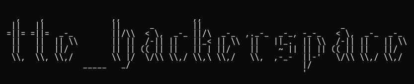

*espaço comunitário e colaborativo para estudantes da fatec interessadas em tecnologia, segurança e cultura hacker *

---
## visão geral

Este projeto tem como aspiração construir uma comunidade na fatec de entusiastas em segurança, promover a boa e velha hacker culture. nossa proposta é criar um espaço de aprendizado, troca de ideias, experimentação e colaboração. 

---
## MVP esboço - offensive security

### blog:
Artigos abordando fundamentos essenciais em volta do contexto de segurança ofensiva: sistemas operacionais, redes, web, tecnicas de pesquisa, metodologia de pentest e subtópicos relacionados.

O conteúdo vai ser direcionado para estudantes interessados em aprender hacking e não sabem por onde começar. Objetivamente, o propósito desses materiais, é oferecer o repertório técnico necessário para que os estudantes possam continuar suas pesquisas de forma autônoma.
### labs:
para apoiar os recursos teóricos, os labs vão ilustrar as classes de vulnerabilidades discutidas nos artigos, dessa forma, vamos aplicar na prática as tecnicas discutidas nos artigos e entender como os fundamentos explicam as peculiaridades e comportamentos de uma classe de vulnerabilidade. Adicionalmente, os labs proporcionam a perspective de white box em que podemos fazer a code review de uma funcionalidade vulneravél e entender como mecanismos defensivos podem ser implementados.

---
## blog - backlog
...

---
## labs - backlog
...

---
## objetivos da comunidade

Acredito que a proposta inicial de introduzir programadores em segurança ofensiva pode atrair outros pesquisadores na nossa faculdade, nessa prerrogativa podemos organizar outras atividades protagonizadas por diversos estudantes, seja um treinamento, apresentação de pesquisa recente ou até mesmo participar em programas de bug bounty como colaboradores.